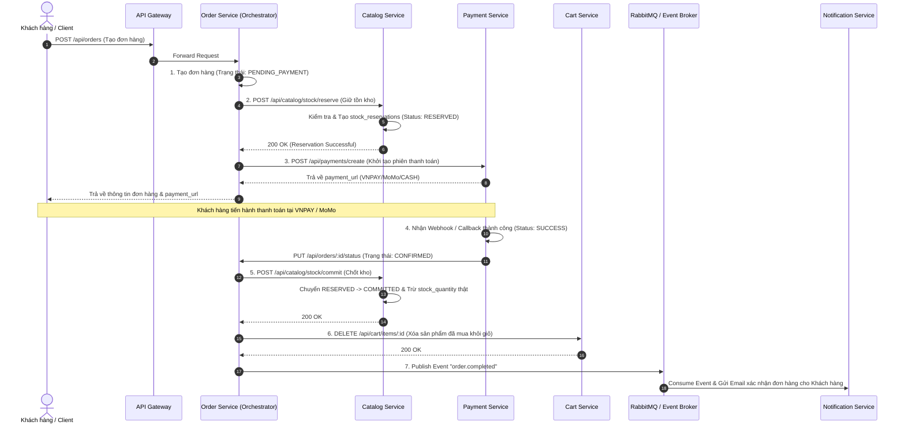
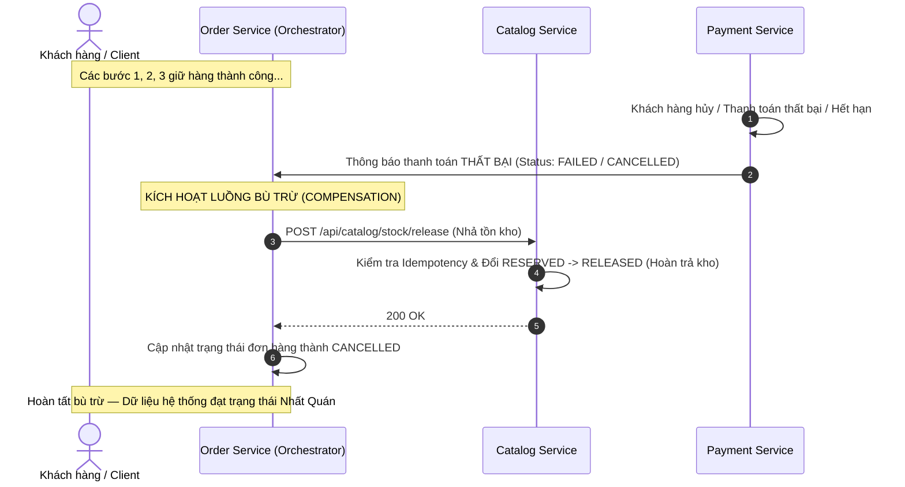

# BÁO CÁO KỸ THUẬT & THIẾT KẾ KIẾN TRÚC: ÁP DỤNG SAGA PATTERN TRONG QUẢN LÝ GIAO DỊCH PHÂN TÁN

> **Dự án:** Website Thương Mại Điện Tử Ứng Dụng Học Máy Trong Gợi Ý Sản Phẩm  
> **Kiến trúc:** Microservices (Database-per-Service)  
> **Mẫu thiết kế:** Saga Pattern (Orchestration Model)  
> **Thực thể điều phối (Orchestrator):** `order-service`

---

## 1. Đặt Vấn Đề: Giới Hạn Của Giao Dịch Truyền Thống (ACID) Trong Microservices

Trong các hệ thống Monolithic (nguyên khối) truyền thống sử dụng một cơ sở dữ liệu duy nhất, tính toàn vẹn dữ liệu được đảm bảo thông qua các giao dịch **ACID** (*Atomicity, Consistency, Isolation, Durability*). Nếu bất kỳ bước nào trong quy trình mua hàng gặp lỗi, hệ thống chỉ cần phát lệnh `ROLLBACK` để khôi phục trạng thái ban đầu.

Tuy nhiên, trong hệ thống **Microservices** của dự án chúng ta, mô hình **Database-per-Service** được áp dụng triệt để:
- **`identity-service`**: Quản lý cơ sở dữ liệu `identity_db` (Tài khoản, Phân quyền).
- **`catalog-service`**: Quản lý cơ sở dữ liệu `catalog_db` (Sản phẩm, Biến thể, Tồn kho).
- **`cart-service`**: Quản lý cơ sở dữ liệu `cart_db` (Giỏ hàng người dùng).
- **`order-service`**: Quản lý cơ sở dữ liệu `order_db` (Đơn hàng, Chi tiết đơn hàng).
- **`payment-service`**: Quản lý cơ sở dữ liệu `payment_db` (Giao dịch thanh toán VNPAY/MoMo/CASH).
- **`notification-service`**: Quản lý cơ sở dữ liệu `notification_db` (Lịch sử & Mẫu email).

```
+------------------+      +------------------+      +------------------+
|  order-service   |      | catalog-service  |      | payment-service  |
|   (order_db)     |      |   (catalog_db)   |      |   (payment_db)   |
+--------+---------+      +--------+---------+      +--------+---------+
         |                         |                         |
         +-------------------------+-------------------------+
                                   |
                  Giao dịch phân tán dài hạn (Saga)
```

Khi thực hiện quy trình Đặt hàng & Thanh toán (Checkout), dữ liệu cần được thay đổi đồng thời trên nhiều cơ sở dữ liệu độc lập. Việc áp dụng các giải pháp giao dịch phân tán truyền thống như **Two-Phase Commit (2PC)** gây ra các vấn đề nghiêm trọng:
1. **Khóa dữ liệu diện rộng (Distributed Locking):** Làm tăng thời gian chờ (latency) và giảm hiệu năng xử lý đáng kể.
2. **Single Point of Failure:** Nếu một service hoặc DB bị gián đoạn, toàn bộ hệ thống bị treo.
3. **Không phù hợp với cổng thanh toán bên thứ ba:** Không thể đưa các cổng thanh toán bên ngoài (VNPAY, MoMo) vào trong một giao dịch 2PC ACID.

**Giải pháp:** Áp dụng **Saga Pattern** với mô hình **Eventual Consistency** (Nhất quán cuối).

---

## 2. Giải Pháp Saga Pattern & Lựa Chọn Mô Hình Orchestration

### 2.1. Định nghĩa Saga Pattern
Saga Pattern chia một giao dịch phân tán lớn thành một chuỗi các **giao dịch cục bộ (Local Transactions)**. 
- Mỗi giao dịch cục bộ chỉ cập nhật dữ liệu trong **một** Service / Database duy nhất.
- Khi một bước hoàn tất, nó sẽ kích hoạt bước tiếp theo thông qua HTTP API hoặc Message Event.
- Nếu một bước thất bại, hệ thống sẽ thực thi chuỗi **Giao dịch bù trừ (Compensating Transactions)** theo chiều ngược lại để hoàn tác các thay đổi đã thực hiện trước đó.

### 2.2. Lựa chọn Mô hình Saga Orchestration
Saga có hai hình thức triển khai chính:
1. **Choreography (Vũ đạo):** Các service tự lắng nghe và phát event để chuyển tiếp luồng (không có điểm điều khiển trung tâm).
2. **Orchestration (Điều phối - Nhạc trưởng):** Một service đóng vai trò nhạc trưởng điều phối toàn bộ các bước của Saga.

**Hệ thống lựa chọn Saga Orchestration với `order-service` đóng vai trò là Orchestrator.**

#### Lý do lựa chọn Saga Orchestration:
- **Quy trình tuần tự & rõ ràng:** Luồng đặt hàng trải qua các bước cố định (Giữ hàng -> Khởi tạo thanh toán -> Xác nhận thanh toán -> Chốt kho -> Làm trống giỏ -> Gửi mail).
- **Tránh phụ thuộc vòng quanh (Cyclic Dependencies):** Tránh việc `catalog-service`, `payment-service`, `cart-service` phải biết quá nhiều về logic của nhau.
- **Dễ quản lý & Giám sát trạng thái:** `order-service` lưu giữ trạng thái tổng thể của Saga, giúp dễ dàng tra cứu, kiểm vết (audit trail) và debug khi xảy ra lỗi.

### 2.3. Bảng Phân Tích Sự Thay Đổi Trạng Thái Hệ Thống (State Transition Table)

Dưới đây là ma trận trạng thái của Đơn hàng (Order), Thanh toán (Payment) và Tồn kho (Stock) qua từng bước trong chuỗi Saga:

| Bước thực thi | Trạng thái Đơn hàng (Order) | Trạng thái Thanh toán (Payment) | Trạng thái Giữ hàng (Stock Reservation) | Trạng thái Kho vật lý (Product Variant) |
| :--- | :--- | :--- | :--- | :--- |
| **1. Khởi tạo** | `PENDING_PAYMENT` | `PENDING` | Chưa giữ hàng | `stock_reserved` không đổi, `stock_quantity` không đổi |
| **2. Giữ kho thành công** | `PENDING_PAYMENT` | `PENDING` | `RESERVED` | **Tăng** `stock_reserved` theo số lượng đặt |
| **3. Thanh toán thành công** | `CONFIRMED` | `SUCCESS` | `COMMITTED` | **Giảm** `stock_quantity` (xuất thật), **Giảm** `stock_reserved` (giải phóng giữ chỗ) |
| **4. Thanh toán thất bại / Hủy** | `CANCELLED` | `FAILED` hoặc `EXPIRED` | `RELEASED` | **Giảm** `stock_reserved` về ban đầu (hoàn trả kho khả dụng) |

---

## 3. Kịch Bản Vận Hành Chi Tiết (Saga Workflows)


### 3.1. Luồng Giao Dịch Thành Công (Happy Path)



#### Các bước thực thi chi tiết:
1. **`order-service`**: Tạo đơn hàng ở trạng thái `PENDING_PAYMENT`.
2. **`order-service` -> `catalog-service`**: Gọi API giữ hàng tạm thời (*Reserve Stock*). `catalog-service` ghi nhận bản ghi giữ hàng với trạng thái `RESERVED`.
3. **`order-service` -> `payment-service`**: Gọi API khởi tạo giao dịch thanh toán.
4. **`payment-service`**: Xử lý cổng VNPAY/MoMo. Khi thanh toán thành công, đổi trạng thái thanh toán thành `SUCCESS`.
5. **`payment-service` -> `order-service`**: Thông báo thanh toán thành công, `order-service` chuyển trạng thái đơn hàng thành `CONFIRMED`.
6. **`order-service` -> `catalog-service`**: Gọi API chốt tồn kho (*Commit Stock*). `catalog-service` đổi trạng thái bản ghi giữ hàng thành `COMMITTED` và thực hiện trừ số lượng tồn kho thực tế.
7. **`order-service` -> `cart-service`**: Xóa các sản phẩm vừa được mua khỏi giỏ hàng (chỉ xóa đúng item đã mua).
8. **`order-service` -> RabbitMQ**: Phát sự kiện `order.completed` để `notification-service` tiêu thụ và gửi email xác nhận.

#### ⚠️ Làm rõ sự khác biệt giữa 3 hành động tồn kho (Tránh lỗi trừ kho 2 lần hoặc treo kho):
Để tránh lỗi lập trình phổ biến trong Saga (như trừ kho hai lần hoặc giữ kho mà không nhả khi hủy giao dịch), các lập trình viên cần hiểu rõ cơ chế hoạt động của 3 hành động:
- **1. Reserve Stock (Giữ hàng tạm thời):**
  - **Mục đích:** Tạm giữ một lượng sản phẩm cho khách hàng trong khi đợi họ thực hiện thanh toán qua cổng ngoài (VNPAY/MoMo).
  - **Thao tác vật lý:** Chỉ thực hiện cộng thêm vào trường `stock_reserved` (tồn giữ chỗ) của bản ghi `product_variants`. **Tuyệt đối không được trừ** vào trường `stock_quantity` (tồn kho thật). Đồng thời tạo bản ghi giữ chỗ `StockReservation` ở trạng thái `RESERVED`.
  - **Ý nghĩa:** Kho khả dụng (Available = `stock_quantity` - `stock_reserved`) giảm đi để người khác không mua được nữa, nhưng tồn kho thật vẫn nguyên vẹn.
- **2. Commit Stock (Chốt xuất kho chính thức):**
  - **Mục đích:** Chốt xuất hàng thực tế sau khi nhận được xác nhận thanh toán thành công.
  - **Thao tác vật lý:** Thực hiện **trừ đồng thời** ở cả hai trường: giảm `stock_quantity` (trừ tồn kho thật) và giảm `stock_reserved` (giảm lượng giữ chỗ). Đồng thời chuyển trạng thái `StockReservation` thành `COMMITTED`.
  - **Ý nghĩa:** Giải phóng lượng giữ chỗ vì hàng đã thực sự được xuất đi. Số lượng tồn kho giảm vĩnh viễn tương ứng với đơn hàng.
- **3. Release Stock (API Bù trừ - Hoàn trả tồn kho):**
  - **Mục đích:** Trả lại lượng hàng đã giữ chỗ về kho khả dụng bình thường khi thanh toán thất bại, hết hạn thanh toán hoặc bị hủy.
  - **Thao tác vật lý:** Chỉ thực hiện **giảm** trường `stock_reserved` (giảm lượng giữ chỗ). **Tuyệt đối không được cộng thêm** vào `stock_quantity`. Đồng thời chuyển trạng thái `StockReservation` thành `RELEASED`.
  - **Ý nghĩa:** Đưa lượng hàng giữ chỗ này quay trở lại cho người mua khác lựa chọn.

---

### 3.2. Luồng Giao Dịch Bù Trừ (Compensating Path - Khi Thanh Toán Thất Bại / Hủy)




#### Các bước thực thi chi tiết:
1. **Phát hiện sự cố:** Khách hàng chủ động hủy thanh toán, tài khoản không đủ tiền, hoặc hết thời hạn thanh toán quy định (Timeout).
2. **Kích hoạt Bù trừ (Compensation):** `order-service` nhận được kết quả thất bại từ `payment-service`.
3. **`order-service` -> `catalog-service`**: Gọi API bù trừ nhả tồn kho (`POST /api/catalog/stock/release`).
4. **`catalog-service`**: Cập nhật trạng thái bản ghi giữ hàng từ `RESERVED` sang `RELEASED`, nhả lại lượng tồn kho khả dụng để người dùng khác có thể mua.
5. **`order-service`**: Cập nhật trạng thái đơn hàng thành `CANCELLED`.

---

## 4. Thiết Kế Cơ Sở Dữ Liệu & API Phục Vụ Saga

### 4.1. Cấu trúc Bảng `stock_reservations` (`catalog-service`)

Bảng `stock_reservations` đã được định nghĩa sẵn trong `prisma/schema.prisma` của `catalog-service` để quản lý việc giữ hàng tạm thời:

```prisma
enum ReservationStatus {
  RESERVED   // Đang giữ hàng chờ thanh toán
  COMMITTED  // Đã thanh toán thành công, chốt trừ kho
  RELEASED   // Thanh toán thất bại/hủy, đã nhả kho (Bù trừ)
}

model StockReservation {
  id             BigInt            @id @default(autoincrement())
  reservation_id String            @unique @db.Uuid
  order_id       String            @db.Uuid
  variant_id     String            @db.Uuid
  quantity       Int
  status         ReservationStatus @default(RESERVED)
  created_at     DateTime          @default(now()) @db.Timestamptz
  updated_at     DateTime          @default(now()) @updatedAt @db.Timestamptz

  variant        ProductVariant    @relation(fields: [variant_id], references: [id])

  @@map("stock_reservations")
}
```

### 4.1.2. Định Nghĩa Trạng Thái Enum Cho Đơn Hàng & Thanh Toán

Để đồng bộ và kiểm soát chặt chẽ trạng thái Saga phân tán, các database của `order-service` và `payment-service` phải định nghĩa chính xác cấu trúc Enum như sau:

#### 1. Trạng thái Đơn hàng (`order-service`):
```prisma
enum OrderStatus {
  PENDING_PAYMENT  // Đơn hàng đã được tạo, đang chờ khách hàng thanh toán qua cổng ngoài
  CONFIRMED        // Đơn hàng đã được xác nhận (nhận thanh toán thành công hoặc thanh toán CASH)
  SHIPPING         // Đơn hàng đang trong quá trình vận chuyển
  COMPLETED        // Giao hàng thành công, hoàn tất đơn hàng
  CANCELLED        // Đơn hàng bị hủy (do thanh toán thất bại, hết hạn giữ chỗ hoặc khách hàng hủy)
}
```

#### 2. Trạng thái Thanh toán (`payment-service`):
```prisma
enum PaymentStatus {
  PENDING          // Yêu cầu thanh toán đã được khởi tạo, đang đợi callback kết quả
  SUCCESS          // Giao dịch thanh toán thành công hợp lệ
  FAILED           // Giao dịch thanh toán thất bại từ phía ngân hàng/cổng thanh toán
  EXPIRED          // Khách hàng không thực hiện thanh toán trong thời hạn quy định (phiên bị hết hạn)
  REFUNDED         // Giao dịch thanh toán đã được hoàn tiền thành công
}
```


### 4.2. Danh Sách API Endpoints Phục Vụ Saga

| Service | Endpoint | Method | Mô tả |
| :--- | :--- | :--- | :--- |
| `catalog-service` | `/api/catalog/stock-reservations` | `POST` | Giữ hàng cho 1 sản phẩm |
| `catalog-service` | `/api/catalog/stock-reservations/batch` | `POST` | Giữ hàng theo lô cho toàn bộ đơn hàng |
| `catalog-service` | `/api/catalog/stock-reservations/:id/commit` | `PUT` | Chốt kho theo `reservationId` |
| `catalog-service` | `/api/catalog/stock-reservations/by-order/:orderId/commit` | `PUT` | Chốt kho cho toàn bộ đơn hàng theo `orderId` |
| `catalog-service` | `/api/catalog/stock-reservations/:id/release` | `PUT` | API Bù trừ: Nhả kho theo `reservationId` |
| `catalog-service` | `/api/catalog/stock-reservations/by-order/:orderId/release` | `PUT` | API Bù trừ: Nhả kho cho toàn bộ đơn hàng theo `orderId` |
| `payment-service` | `/api/payments/create` | `POST` | Khởi tạo phiên thanh toán (VNPAY/MoMo/CASH) |
| `payment-service` | `/api/payments/vnpay/return` | `GET` | Webhook / Return URL VNPAY |
| `payment-service` | `/api/payments/momo/return` | `GET` | Webhook / Return URL MoMo |
| `order-service` | `/api/orders/:id/status` | `PUT` | Cập nhật trạng thái đơn hàng từ Payment |

---

## 5. Giải Quyết Các Thách Thức Kỹ Thuật Khi Triển Khai Saga

### 5.1. Tính Luỹ Đẳng (Idempotency)
Trong môi trường mạng phân tán, một yêu cầu API bù trừ có thể bị gửi lặp lại nhiều lần do cơ chế Retry hoặc nghẽn mạng.
- **Giải pháp:** Sử dụng `order_id` / `reservation_id` làm **Idempotency Key**.
- **Cách xử lý tại `catalog-service`:**
  - Khi nhận yêu cầu `/release` cho một `order_id` hoặc `reservation_id`, kiểm tra trạng thái của `stock_reservations` tương ứng.
  - Nếu trạng thái đã là `RELEASED`, trả về bản ghi thành công ngay lập tức mà **không** thực hiện hoàn kho thêm lần nào nữa.
  - Tương tự với `/commit`: nếu trạng thái đã là `COMMITTED`, trả về thành công mà **không** trừ kho kép.

### 5.2. Xử Lý Giao Dịch Treo (Stale Reservations & Timeouts)
Nếu người dùng tắt trình duyệt sau khi tạo đơn mà không thực hiện thanh toán hay bấm hủy:
- **Background Cron Job:** `catalog-service` có thể chạy cron job định kỳ quét các bản ghi `RESERVED` lâu chưa được thanh toán (ví dụ: tạo > 15 phút), tự động phát lệnh `release` để nhả lượng tồn kho khả dụng.

### 5.3. Độ Tự Tin Của Truyền Tin (Reliable Messaging & DLQ)
Đối với bước xuất bản sự kiện gửi email qua RabbitMQ (`order.completed`):
- Sử dụng cơ chế **Confirm Select / Publisher Confirms** của RabbitMQ để đảm bảo tin nhắn được ghi nhận an toàn tại Message Broker.
- Cấu hình **Dead Letter Queue (DLQ)** để hứng các tin nhắn lỗi giúp dễ dàng kiểm tra và phát lại (re-queue) khi cần.

---

## 6. Kế Hoạch Triển Khai (Implementation Roadmap)

1. **Giai đoạn 1 (Catalog Service Update) — [HOÀN THÀNH]:**
   - Đã kiểm tra: Enum `ReservationStatus` và bảng `StockReservation` đã được định nghĩa sẵn trong `schema.prisma`.
   - Đã nâng cấp `stock-reservation.service.ts` sang Prisma Client singleton (`src/config/prisma.ts`).
   - Đã xây dựng hoàn thiện các API `/stock-reservations`, `/batch`, `/by-order/:orderId/commit`, `/by-order/:orderId/release` đảm bảo tính luỹ đẳng (Idempotency).
2. **Giai đoạn 2 (Order Service Orchestration) — [HOÀN THÀNH]:**
   - Đã tái cấu trúc `order.service.ts` để điều phối toàn bộ quy trình: Giữ kho (`/batch`), Khởi tạo thanh toán (`/create`), Chốt kho (`/commit`) và Bù trừ nhả kho (`/release`).
   - Tích hợp logic xử lý riêng cho tiền mặt (`CASH`), chốt tồn kho ngay sau khi tạo đơn hàng thành công.
   - Viết logic bù trừ tự động trong khối `catch` / error handler: Đơn hàng tự động được đổi thành `CANCELLED` và gọi API trả lại kho khi có lỗi.
3. **Giai đoạn 3 (Payment & Webhook Synchronization) — [HOÀN THÀNH]:**
   - Đã tích hợp thành công Webhook (IPN) từ VNPAY và MoMo về `payment-service`.
   - Áp dụng xác thực chữ ký (Checksum/Signature verification) để bảo mật endpoint Webhook.
   - Viết cơ chế Idempotency chống gọi đúp Webhook, đồng thời tự động cập nhật và gọi `order-service` để chốt đơn/nhả kho.
4. **Giai đoạn 4 (Event-Driven Notifications) — [HOÀN THÀNH]:**
   - Đăng ký RabbitMQ publisher tại `order-service` và subscriber tại `notification-service`.


---
*Tài liệu này được biên soạn làm chuẩn kiến trúc cho toàn bộ đội ngũ phát triển phần Backend & Microservices của dự án.*
